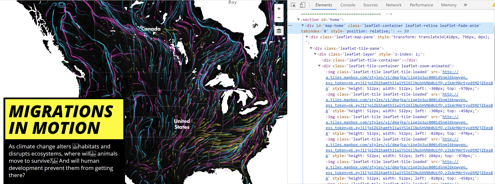
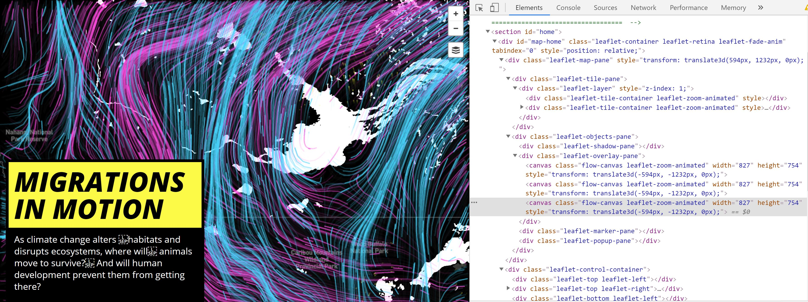
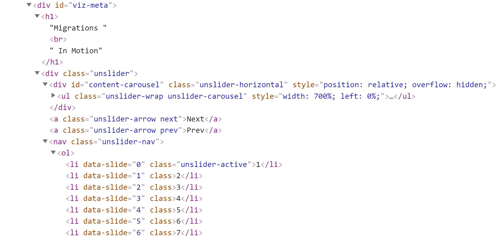
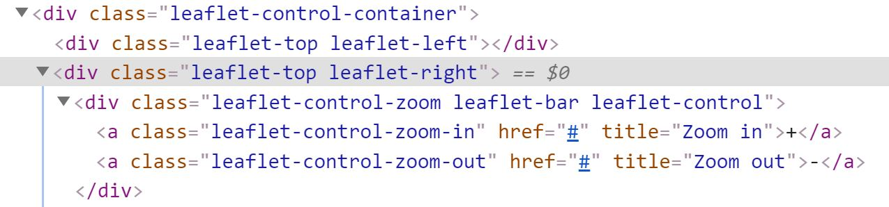
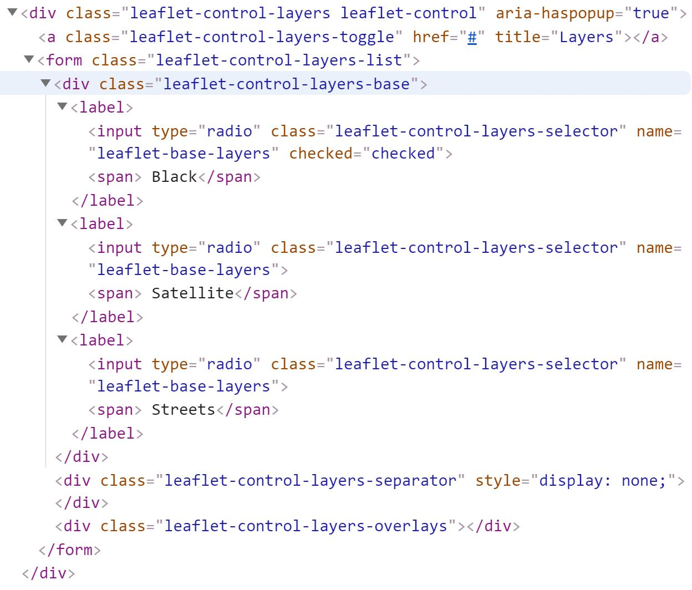
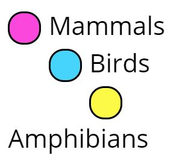
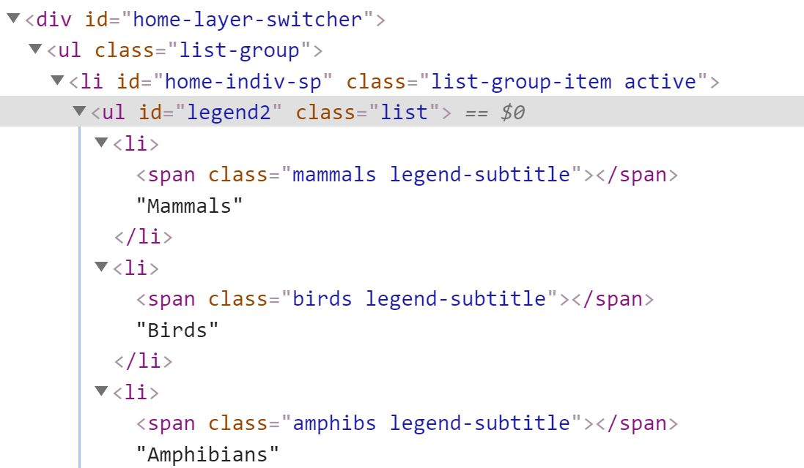

# "Migrations in Motion" Web Map Essay

Caption: screenshot of the cover of the web map. Here is the [link to Web Map!](http://maps.tnc.org/migrations-in-motion/#4/45.58/-117.86)
  

<h3> Introduction </h3>

The goal of the map was to help scientists and the public see the changing habitat locations of thousands of vertebrates due to climate change. The predicted corridors for animal travel can then be used a reference for scientists and public figures to enact change and change construction methods to ensure these corridors are not completing blocked for the animals. The more the human landscape inhibits the travel of animals the more animals that will die from climate change because they are not able to travel to the new region with their needed climate for survival. As determined by examining the web map we are able to determine there are large migrations of animals from the South East of the United States to towards the North East. There are also multiple large migrations leaving the Brazil region. From the northern part of Brazil, a large migration is moving West out of the country. Another migration of a large number of animals from Southern Brazil is focused on moving South East closer to the coast of South America. A function of the map was to determine corridors with a large influx of animal migration. These three areas that from visually analyzing map seem to have the largest migrations that are predicted to occur. These areas need to be a focus for reform and transition from a human made environment that is almost impossible for animals to migrate through because of the fragmentation of the land from human construction. Humans need to begin preserving areas and routes that animals would be able to use in their effort to find a new habitat because climate change forced them to migrate. The target audience for this type of research is for scientists specifically those doing climate and animal research. Scientists are able to use these findings to support their research in the effects of climate change on animal migrations. Furthering the research and evidence that these events will occur scientists can help persuade change in the government to support city designs that conserve habitats that will be needed for animals that will be migrating to their areas to find a new suitable habitat. Also, convincing government and city designers to create human made features that decrease the fragmentation of the environment, which we are building upon. Fragmentation of habitat from human-made features could be the end for many vertebrates that will be migrating from increased temperatures in their current unhospitable habitats. Climate change will alter the ecosystems around the world and to be able to adapt and survive animals need to migrate. Humans can either help or hinder this inevitable event by maintaining connectivity between the environment's human made features fragment.

<h3>Authors</h3>

This web map was created by a combined effort between University of Washington and The Nature Conservancy. specifically, the map was created by Dan Majka who is a part of The Nature Conservancy's North America Region science team. The visualization of this web map was made possible using information from three previously produced works.
1. wind map produced by HINT.FM

  [Link to Map](http://hint.fm/wind/)

2. earth wind map by cambecc's

  [Link to Map](https://earth.nullschool.net/)

3. Chris Helm's adaptation of cambecc's code

  [Link to GitHub](https://github.com/FreshyLabs/windy)

<h3> Systematic Architecture </h3>

| Roles | Descripition |
| ----- | ------------ |
| Web Client | This web map is available on the open web for anyone to access. So, this web map resides in the cloud. (The external internet) |
| Web Server | The type of database holding all of the GIS data for this web map is an XML database type. There is .css and .js code stored in this server. |
| Web Services | This web map was created using two web services leaflet and mapbox.  |
| Web Data | The data was produced by the University of Washington and The Nature Conservancy researchers. There were three other data products that contributed to producing this map which are listed above below Authors section. |

<h3> Inspection of the Code </h3>
  

There are multiple Javascrpit data sets being flowed from the server to the client. There is data created using google analytics that is being added to the web map. Mapbox and leaflet were used to create the interactions on the web map and stored in .js file. leaflet helps make this web map usable on mobile devices.  Data from The Nature Conservancy website is being added to the web map. The web map is provided as an open source website for anyone to access and is protected by cloudflare.

The unslider is the interactive part of the map with the title and a few pages of information on the project. The .css code references data to produce this function on the web map. The font used in the web comes from google. The layout of the map was created with the help of mapbox.

<h5> Major Libraries in Use </h5>

1. JavaScrpit Library: which is used to create the interactions between the webpage and the user. The multiple elements on the webpage users are able to use.

2. CSS Library: which is primarily used for design of the web page, so the layout of the webpage is easy and comfortable to interact with for the user.

<h5> Does this Project Support Responsive Design?</h5>

The project does support responsive design. As a user you are able to access the web page and have the same interactions with it on your mobile phone as your computer. There are a few things that could be improved so the web page is able to respond better to changing platforms. When opening this web page on your mobile device the interactive pop-up in the bottom left with the addition information about the project does not resize on the mobile. It takes up a large amount of the screen and when holding the mobile device sideways you are not able to read everything available in the pop-up. Additionally, if you move the map too fast on the mobile the thematic layer takes a second for it to reconfigure itself over the new coordinates.

<h3> Data Sources </h3>

1. The Thematic Layer is a raster layer; it is known as the "flow-canvas leaflet-zoom-animated" layer.

2. Leaflet Basemap layers (rasters) which are produced by OpenStreetMap

  - Black
  - Satellite
  - Streets

3. Mapbox Tiles (raster) there are multiple mapbox tiles that make up the base of the map.

<h5> Critique of UI/UX </h5>

My opinion of the user experience (UX) with the web page is overall user friendly. Simplistic design easy to understand functions available to interact with. The pop-up is a simple design with a using a slider to move between information slides. There are three different basemaps avaliable to use depending on user preference. User is able to transition between 7 zoom levels. In my opinion there are only about 3 or 4 zoom levels that are useful for analyzing the data on the map. When you zoom to close it is hard to understand the importance of the animation. Also, when you zoom too far out less data is shown on the image and does not give the user a good idea of the extent of the data to analyze it correctly. Users are able to move through the web page with relative ease by clicking and dragging the map to the location the user wishes to analyze. This web page in my opinion is easier to navigate with the use of a mouse because you can move the map easier. Things that could be done to improve the user experience is let it be able to zoom in and out using a mouse scroller and be able to minimize the pop-up in the bottom left in order to only focus on the map.

My opinion of the user interface design (UI) of the webpage is that is visually satisfying. The three different colors chosen for the different types of vertebrates makes it easy to distinguish the different migration paths. The Black basemap is the easiest to be able to analyze the thematic data overlaying it. The Satellite and Streets basemaps make it harder to see the thematic data over them. When opening up the website as a user I thought this map was only showing data for North America not until I moved the map did I realize that South America data was also included, which I found confusing. The web page should tell the user in the beginning either in the title or by the set zoom level the extent of where the data covers. The pop-up is easy to read and interpret how to work. The legend is easy to read. As the user you are able to recognize that you can use zoom buttons in the top right to change zoom level of map. Once the user hovers over the basemap button they are able to understand they can change the basemap from black to either of the other two.

<h3> Descriptions of the Layers and Features of Web Map </h3>

<h5>Basemap</h5>

The basemap is created from mapbox tiles that represent the entire planet. The mapbox tiles are characterized by OpenStreetMap designs either Black, Satellite or Streets depending upon which the user picks. In the code the only the mapbox tiles that are present in the extent of the screen are able to analyzing in the inspector code.

Example of the code for the mapbox basemaps tiles:

<h5>Thematic Layer</h5>

The thematic layer is a raster layer that is animated and repeated on a loop. The layer shows the predicted migration trails of the different types of vertebrates throughout North and South America. When you move the map, the layer disappears and then reappears replaying on the same loop for what location the user is on. The further the user zooms out the fewer migration paths visible and opposite for when the user zooms in the number of paths increases. The transform function in the code is used so the thematic layer is able to be scaled and moved to when the user does an action on the web map.

Thematic Layer Code:

<h5>Interactive Features</h5>

1. Pop-up Window Bottom Left Corner
The pop-up window has a slider, so the user is able to move through the different slides by clicking the "Next" or "Prev" buttons or clicking a specific dot which is correlated to a slide. The purpose of this feature is to give the user more context for the web map, cite the sources, and provide more information on the topic.

Pop-up Window Code:

2. Zoom Control
The user is able to click either the - button to zoom out or the + to zoom in.

Zoom Control Code:

3. Layer control
The user is able to choose from three different base layers Black, Satellite, and Streets.

Layer Control Code:

<h5>Web Map Elements</h5>

1. legend which is a list of the three different vertebrates shown in the map

legend

  
Legend code:

<h3> Analysis of Strengths and Weaknesses of Project</h3>

Strengths of the project is it was created by two reputable organizations University of Washington and The Nature Conservancy. Making the information created for this website reliable for users to analyze. The project does succeed in creating a map that shows the future migration paths of vertebrates in North and South America. Users are able to focus on specific areas of interest because there is enough data that the map is very detailed when zoomed in. Using an animated thematic layer gives the user a real sense of what corridors will be used by animals in their migrations. The data represents the animal corridors well, which translates well when trying to use this web map to influence people about the need to transition building plans to accommodate for these migrations. The project really puts into perspective the relevance of climate change on vertebrates and how much animals are affected by changing of average temperatures around the globe.

Weaknesses of the project are the benefits of it are not fully discussed. Were the costs of the project worth the benefits that come of its creation? In the project, there is a short description of what we can do with the information. What I would like to see is other sources for how we could enact this type of change in our communities. For the average user this map is just something aesthetically pleasing to look at, but there is very little I can do to help improve my community for the impending migration of these species. How has this project exposed itself to the people that need to see this analysis of data to create change in our infrastructure, like the conservationists and land managers mentioned in the project. Another weakness of the project is more of a visual problem when analyzing the web page it is sometimes hard to visualize the amphibians migrations through the mammals and birds because they move less distance and the yellow does not pop as well of the basemap. An addition of being able to select one or all of the different vertebrates visible on the map would make it easier to analyze the amphibian's migration paths.

<h3> Reflection </h3>

The problem the project is trying to support change for is a deep seeded capitalist mindset of building and growing and creating things in the most cost-effective ways without regard for environmental impacts. This project is trying to gather evidence that this mass migration is going to happen/is currently beginning and we are going to lose a lot of the animal's humans objectively like, but what really important is these animals are irreplaceable in stable ecosystems. The project does not explicitly say this but my interpretation is that we cannot keep progressing with urban sprawl outside our cities it is creating more fragmentation of the environment cutting off the corridors for animals to successfully travel through. Also, the project is going after the idea that the freeways and highways we create do not just need to cut a straight path. We can engineer overpasses and underpasses for animals that could be safe for them to migrate through and minimizing the death rate of animals from automobiles. There is a need to give a voice at the table for animals, so we are able to build future human features that do minimal damage to the survival of the ecosystems that are only becoming more fragile as climate change increases. Climate change is real and should be present on everyone's mind it is happening now. Animals are migrating to stay alive and if humans want to support their efforts in trying to find a new habitat, we need to increase our awareness and knowledge on how to help. 

<h3> References </h3>

[Article 1: Migration in Motion](https://blog.nature.org/science/2016/08/19/migration-in-motion-visualizing-species-movements-due-to-climate-change/)

[Article 2: Species on the Move](https://blog.nature.org/science/2016/06/29/species-on-the-move-mapping-barriers-for-wildlife-in-a-warming-world/?utm_source=cgs&utm_medium=alsoin&utm_campaign=migrations)
